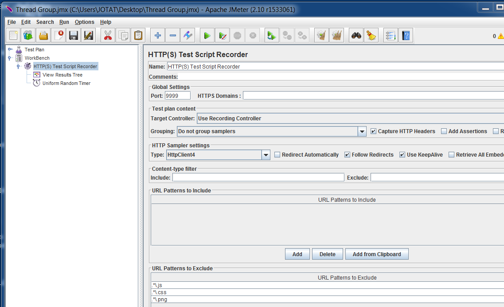
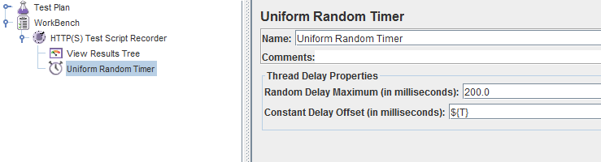
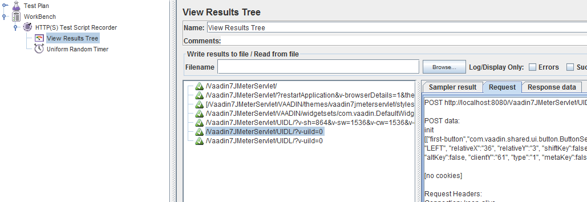
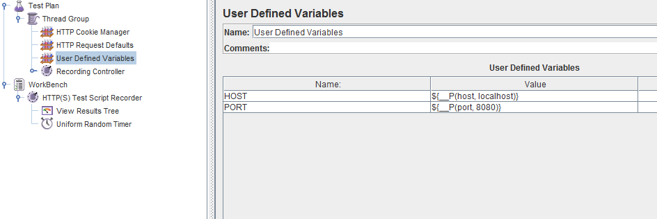
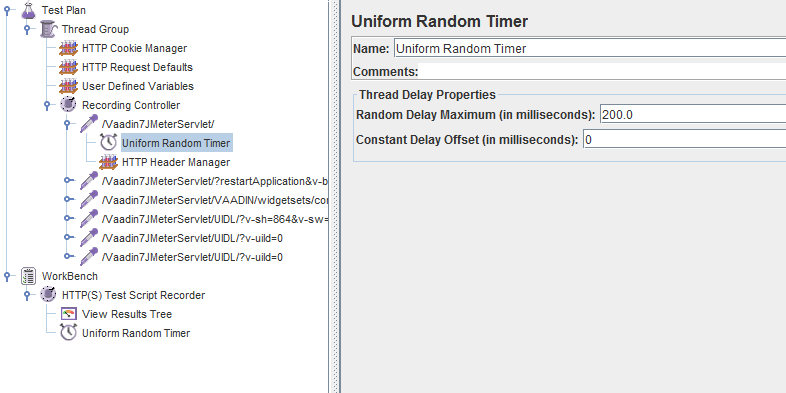

// Converted from the Wiki by Marko Grönroos on 2016-09-23

= How to Test Vaadin Application Performance with JMeter

[.author]
Johannes Tuikkala, Teemu Pöntelin, Matti Hosio, and Philippe Mouawad

This article describes how to make load testing of your Vaadin web application with JMeter.

== Setting Up JMeter

=== Install JMeter

Download the latest JMeter from http://jmeter.apache.org/download_jmeter.cgi

=== Configure JMeter

Unzip the [filename]#apache-jmeter-x.x.x.zip# file.

Edit [filename]#JMETERHOME/bin/jmeter.bat# (Windows) or [filename]#jmeter.sh# (Linux and OS X) and check that the JVM memory parameters are OK (for example, "`set HEAP=-Xms512m -Xmx1500m -Xss128k`").
The maximum heap size (`-Xmx`) should be at least 1024m.
We would also recommend that the thread stack size is set to 512k or below if a large number of threads is used in testing.

You should read the following to ensure you follow best-practices:

* http://jmeter.apache.org/usermanual/best-practices.html
* http://www.ubik-ingenierie.com/blog/jmeter_performance_tuning_tips/

=== Start JMeter

Start JMeter by, for example, double clicking the [filename]#jmeter.bat# or [filename]#jmeter.sh# file.

== Configure Your Test Plan and WorkBench

. Right-click the WorkBench icon and select "Add > Non-Test Elements > HTTP(S) Test Script Recorder".

** Set [guilabel]#Port# to, for example, 9999 (you could leave it to 8080 if your web application servers do not use the port 8080).

** Edit other Recorder parameters

** Typically, requests related to loading static web content such as CSS files and images are excluded from the load test.
You can use [guilabel]#URL Patterns to Exclude# section of the recorder to define what content is excluded.
For example, to exclude CSS files, add the following pattern: `.\.css`.

+
.Test Script Recorder settings

** Right-click the Recorder icon and select "Add > Timer > Uniform random timer".
Configure timer by setting the [guilabel]#Constant Delays Offset# into `${T}`.
This setting means that JMeter records also the delays between the http requests.
You could also test without the timer but with the timer your test is more realistic.

+
.Uniform Random Timer settings

** Optionally, you could also add [guilabel]#View Result Tree# listener under the Recorder.
With [guilabel]#View Result Tree# listener, it is possible to inspect every recorded request and response.

+

+
[NOTE]
Note that in JMeter you can do this in one step using menu item [guilabel]#Templates...# and selecting a [guilabel]#Recording# template.

. Next, configure the [guilabel]#Test Plan#:

.. Add a [guilabel]#Thread Group# to it and then add a "Config Element > HTTP Cookie Manager" to the thread group.
.. Set Cookie policy of the cookie manager to be `compatibility`.
.. Remember also to set the [guilabel]#Clear cookies each iteration# setting to 'checked'.
.. Also add a "Config Element > HTTP Request Defaults" into the thread Group.

.. (Optional) You could also add a "Config Element > User Defined Variables" and a "Logic Controller > Recording Controller" into the thread group.

Your JMeter should now look something like in the following screenshot:

== Configuring your Vaadin Application

=== Disabling the XSRF Protection

In Vaadin, you have to disable the XSRF protection of your application, or otherwise the JMeter test may fail.
The way how XSRF protection is disabled differs in Vaadin 6 and Vaadin 7.

==== In Vaadin 7

If you use `web.xml` in your Vaadin 7 project, add the following context parameter in the `web.xml` or optionally add it as an init parameter just like in the Vaadin 6 project below.

----
<context-param>
   <param-name>disable-xsrf-protection</param-name>
   <param-value>true</param-value>
</context-param>
----

If you use annotation-based (Servlet 3.0) Vaadin servlet configuration, you can currently (in Vaadin 7.1.11) either fall back to Servlet 2.4 `web.xml` configuration or set the parameter value for `disable-xsrf-protection` as a [classname]#java.lang.System# property before the Vaadin's [classname]#DefaultDeploymentConfiguration# is loaded.
This can be done for example by extending the [classname]#VaadinServlet# class.
At the end of this article there is an example servlet ([classname]#JMeterServlet#) that implements this functionality.
See the example code below for how to replace the default [classname]#VaadinServlet# with your custom servlet in the UI class.

[source, Java]
----
public class YourUI extends UI {

   @WebServlet(value = "/*", asyncSupported = true)
   @VaadinServletConfiguration(productionMode = false, ui = YourUI.class)
   public static class Servlet extends JMeterServlet {
   }

   @Override
   protected void init(VaadinRequest request) {
       //...
   }
----

==== In Vaadin 6

See the example below for how to disable the protection from the `web.xml` file:

[subs="normal"]
----
<servlet>
   <servlet-name>[replaceable]##FeatureBrowser##</servlet-name>
   <servlet-class>com.vaadin.terminal.gwt.server.ApplicationServlet</servlet-class>
   <init-param>
     <param-name>application</param-name>
     <param-value>[replaceable]##com.vaadin.demo.featurebrowser.FeatureBrowser##</param-value>
   </init-param>

   <init-param>
     <param-name>disable-xsrf-protection</param-name>
     <param-value>true</param-value>
   </init-param>
</servlet>
----

[WARNING]
.Important!
----
Remember to enable the protection after the testing is done!
----

=== Disabling `syncId`

Disabling `syncId` can be done with a similar parameter as follows:

----
<context-param>
   <param-name>syncId</param-name>
   <param-value>false</param-value>
</context-param>
----

If you want to do the above with Java Servlet 3.0 annotations, use the following:

[source, Java]
----
initParams = {
       @WebInitParam(name = "disable-xsrf-protection", value = "true"),
       @WebInitParam(name = "syncIdCheck", value = "false")}
----

=== Use Debug IDs in Your Vaadin Application

Normally, a Vaadin application sets a sequential ID for each user interface component of the application.
These IDs are used in the AJAX requests when the component state is synchronized between the server and the client side.
The aforementioned ID sequence is likely the same between different runs of the application, but this is not guaranteed.
In Vaadin 6, these IDs can be manually set by calling [methodname]#setDebugId()# method.

In Vaadin 7, there no more exists a [methodname]#setDebugId()# method; instead there is [methodname]#setId()# method.
Unfortunately, this method will not set component IDs used in the AJAX request.
Therefore, by default, JMeter tests of a Vaadin 7 application are not stable to UI changes.
To overcome this problem, you can use our [classname]#JMeterServlet# (see the end of this article) instead of the default [classname]#VaadinServlet#.
When using the [classname]#JMeterServlet#, component IDs are again used in the AJAX requests.
See example above for how to replace default [classname]#VaadinServlet# with [classname]#JMeterServlet#.
For additional information, see the Vaadin ticket #13396.

=== Use Named Windows in Your Application

Setting the name for the Windows in the Vaadin (< 6.4.X) application is important since otherwise these names are randomly generated.
The window name could be set using the [methodname]#setName()# method.

== Configuring Your Browser

Since JMeter is used as a proxy server, you have to configure the proxy settings of your browser.
You can find the proxy settings of Firefox from "Tools > Options > Connections > Settings": [guilabel]#Manual proxy configuration#.
Set the correct IP of your computer (or '``localhost``' string) and the same port that you set into proxy server settings above.

== Start Recording

. Start your web application server.
. Start the proxy server from the JMeter.
. Open the URL of your web application into the browser configured above. You should append `?restartApplication` to the URL used when recording the tests to make sure that the UI gets initialized properly. Thus the URL becomes something like `http://localhost:8080/test/TestApplication/?restartApplication`.

If everything is OK, your web application should open normally and you should see how the different HTTP requests appear into JMeter's thread group (see the screenshot below).

When you have done the recording, stop the proxy server.

== Performance testing

=== Cleaning Up the Recorded Request

Before you start the test, you may have to delete the first timer object, as its time delay may be unrealistically big (see the screen shot above).
It is located below the first HTTP request in the thread group,

[IMPORTANT]
It is also very much recommended to check the recorded data and delete all unessential requests.

=== Detecting Out of Sync errors

If your test results in the application being in an Out of Sync error state, it means that it is not detected by JMeter by default, because the response code is still `HTTP/1.1 200 OK`.

To make an assertion for detecting this kind of error you should add a [guilabel]#Response Assertion# to your test plan.
Right-click on the thread group and select "Add > Assertions > Response Assertion".
Configure the assertion to assert that the [guilabel]#Text Response# does NOT contain a pattern "[guilabel]#Out of sync#".

=== Optional parameterization of the request

Sometimes, it is useful to parameterize the recorded requests. Parameterization of a request is easily done in JMeter:

. Add a [guilabel]#User Defined Variables# element into the first place of your [guilabel]#Test Plan#.

. Copy & paste the whole parameter value of the wanted UIDL request into the newly made variable (such as `PARAM1`).

. Replace the value of the UIDL-request with the parameter reference (such as `${PARAM1}`).

=== Start testing

Now, it is time to do the actual testing.

. Configure the thread group with proper [guilabel]#Number of Threads# (for example, 100).
. Also set the [guilabel]#Ramp-Up Period# to some realistic value (for example, 120).
. Then add, for example, "Listener > Graph Results" to monitor how your application is performing.
. Finally, start the test from the "Run > Start".

=== Stop on Error

When you are pushing your Vaadin application to the limits, you might get into a situation where some of the UIDL requests fail.
Because of the server-driven nature of Vaadin, it is likely that subsequent requests will cause errors such as "_Warning: Ignoring variable change for non-existent component_".
The reason is that the state stored on the server-side is no longer in sync with the JMeter test script.

In such cases, it is often best to configure your JMeter thread group to stop the thread on sampler error.
However, if you have configured your test to loop, you might want to still continue (and ignore the errors) if the next iteration will start all over again with fresh state.

=== Continuous Integration

If you want to do load testing in your CI system, you can use the https://github.com/jmeter-maven-plugin/jmeter-maven-plugin[JMeter Maven Plugin].

You can read the following about full integration with Jenkins:

* https://blog.codecentric.de/en/2014/01/automating-jmeter-tests-maven-jenkins/[Automating JMeter tests with Maven and Jenkins]

== [classname]#JMeterServlet#

In Vaadin 7, we recommend using the following or similar customized [classname]#VaadinServlet#:

[source, Java]
----
package com.example.vaadin7jmeterservlet;

import com.vaadin.server.ClientConnector;
import com.vaadin.server.DeploymentConfiguration;
import com.vaadin.server.ServiceException;
import com.vaadin.server.VaadinRequest;
import com.vaadin.server.VaadinService;
import com.vaadin.server.VaadinServlet;
import com.vaadin.server.VaadinServletService;
import com.vaadin.server.VaadinSession;
import com.vaadin.ui.Component;

/**
* @author Marcus Hellberg (marcus@vaadin.com)
*  Further modified by Johannes Tuikkala (johannes@vaadin.com)
*/
public class JMeterServlet extends VaadinServlet {
   private static final long serialVersionUID = 898354532369443197L;

   public JMeterServlet() {
       System.setProperty(getPackageName() + "." + "disable-xsrf-protection",
               "true");
   }

   @Override
   protected VaadinServletService createServletService(
           DeploymentConfiguration deploymentConfiguration)
           throws ServiceException {
       JMeterService service = new JMeterService(this, deploymentConfiguration);
       service.init();

       return service;
   }

   private String getPackageName() {
       String pkgName;
       final Package pkg = this.getClass().getPackage();
       if (pkg != null) {
           pkgName = pkg.getName();
       } else {
           final String className = this.getClass().getName();
           pkgName = new String(className.toCharArray(), 0,
                   className.lastIndexOf('.'));
       }
       return pkgName;
   }

   public static class JMeterService extends VaadinServletService {
       private static final long serialVersionUID = -5874716650679865909L;

       public JMeterService(VaadinServlet servlet,
               DeploymentConfiguration deploymentConfiguration)
               throws ServiceException {
           super(servlet, deploymentConfiguration);
       }

       @Override
       protected VaadinSession createVaadinSession(VaadinRequest request)
               throws ServiceException {
           return new JMeterSession(this);
       }
   }

   public static class JMeterSession extends VaadinSession {
       private static final long serialVersionUID = 4596901275146146127L;

       public JMeterSession(VaadinService service) {
           super(service);
       }

       @Override
       public String createConnectorId(ClientConnector connector) {
           if (connector instanceof Component) {
               Component component = (Component) connector;
               return component.getId() == null ? super
                       .createConnectorId(connector) : component.getId();
           }
           return super.createConnectorId(connector);
       }
   }
}
----
